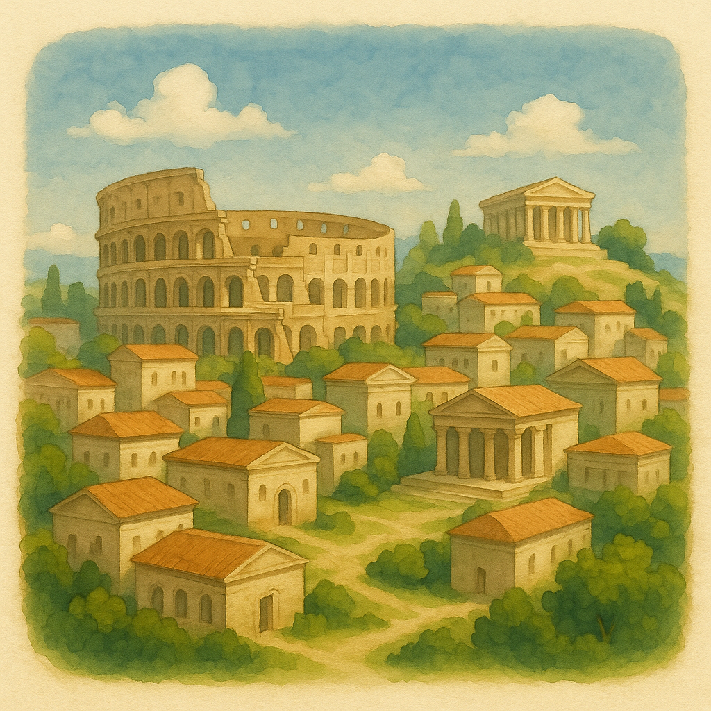
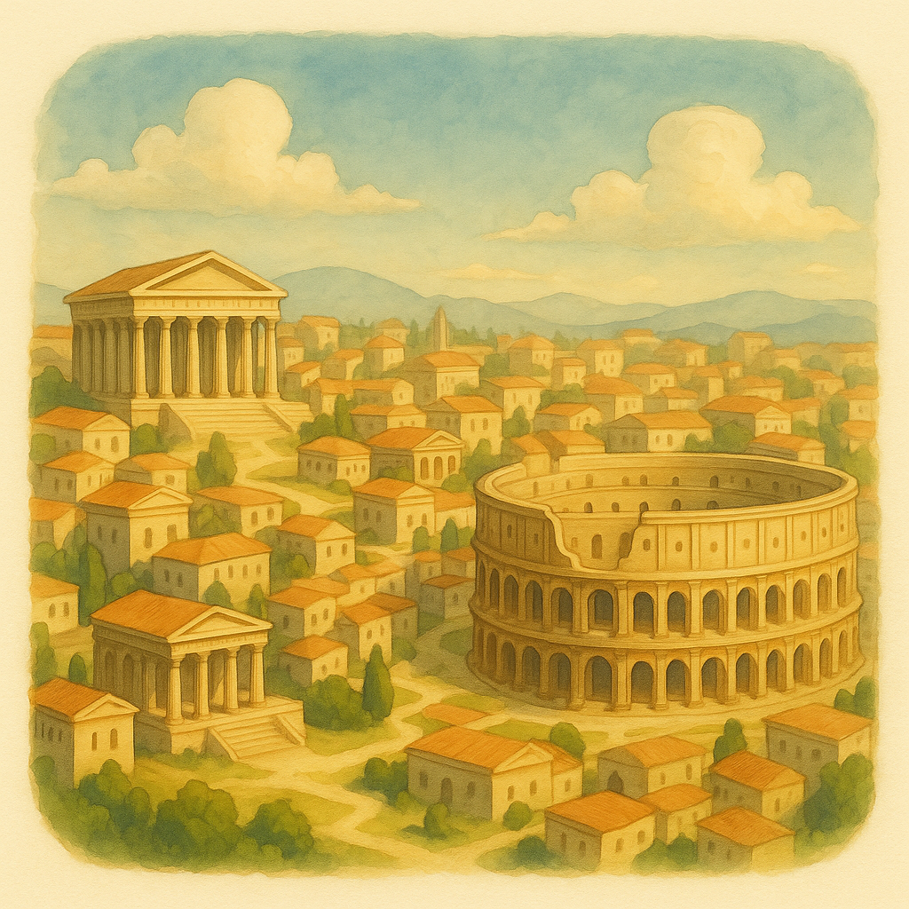

# Arcki

3D world editor. Browse real-world maps, generate models with AI, place them anywhere.

<p align="center">
  
  
</p>

## Stack

Next.js 15, React Three Fiber, Mapbox GL, Supabase, FastAPI

## Run

```bash
# client
cd client && npm i && npm run dev

# server
cd server && pip install -r requirements.txt && python server.py
```

## Env

`client/.env.local`
```
NEXT_PUBLIC_MAPBOX_TOKEN=
NEXT_PUBLIC_SUPABASE_URL=
NEXT_PUBLIC_SUPABASE_ANON_KEY=
NEXT_PUBLIC_API_URL=http://localhost:8000

# GitHub OAuth - for auto-star on icon click (optional)
# Create at https://github.com/settings/developers
# Callback URL: http://localhost:3000/api/auth/github/callback
GITHUB_CLIENT_ID=
GITHUB_CLIENT_SECRET=
```

`server/.env`
```
OPENAI_API_KEY=
FAL_KEY=
```
